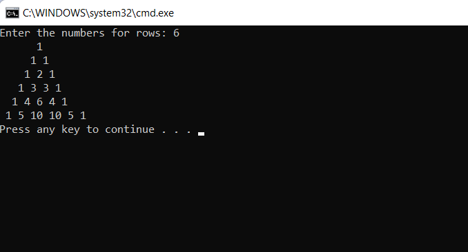

# Pattern

## Aim:

## Equipment Required:

## Algorithm:

## Program:
```
using System;
namespace PascalTriane
{
    public class pascalPattern
    {
        public static void Main(string[] args)
        {
            int rows, i, j,k, count = 1;
            Console.Write("Enter the numbers for rows: ");
            rows = Convert.ToInt32(Console.ReadLine());
            for (i = 0; i < rows; i++)
            {
                for (j = 1; j <= rows - i; j++)
                {
                    Console.Write(" ");
                }
                for (k = 0; k<=i; k++)
                {
                    if (i == 0 || k == 0)
                    {
                        count = 1;
                    }
                    else
                    {
                        count = count * (i - k + 1) / k;
                    }
                 Console.Write("{0} " , count);
                }
                Console.Write("\n");
            }
  
        }
    }
}
```

## Output:


## Result:
